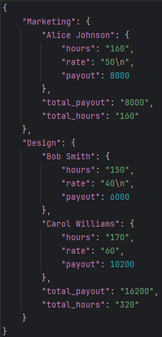

# Описание проекта
Проект читает данные сотрудников из файлов в формате csv и формирует простой отчет по заработной плате в формате json

# Структура проекта
* src/ папка с основным кодом проекта
* tests/ папка для создания тестов проекта

# Установка
1. Клонируйте репозиторий
````
git clone https://github.com/pallantimos/Homework.git
````

# Использование

1. Запустите скрипт с необходимыми параметрами

# Пример использования

````
python main.py test1.csv --report payout
````

Пример отчета:


# Тестирование
Протестированы модули в директории src